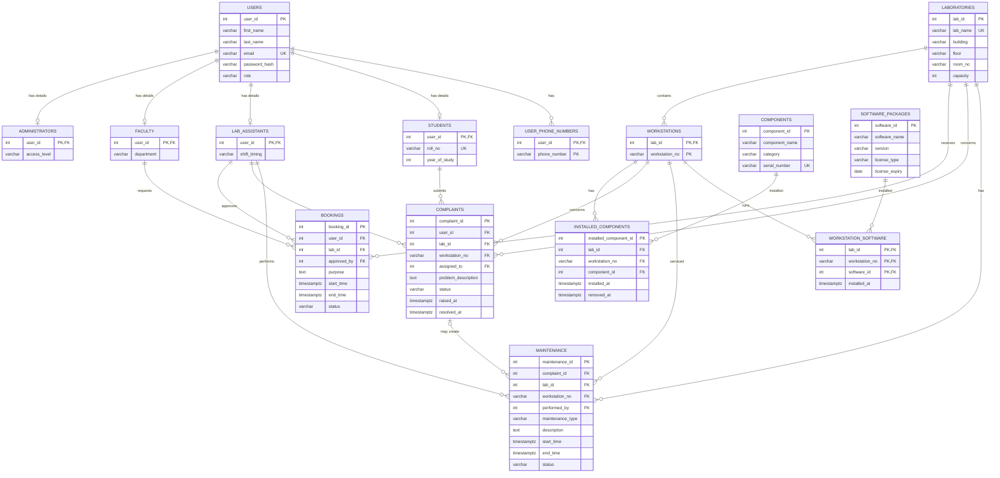

# Laboratory Management System: ER Diagram and Relational Schema

This document describes the PostgreSQL database implemented in `schema.sql`.
The Mermaid diagram can be rendered by VS Code extensions such as Mermaid
Markdown Syntax Highlighting/Preview, or on GitHub.

## Entity relationship diagram



## Relational schema

Primary keys are marked `PK`; foreign keys are marked `FK`.

```text
USERS(
  user_id PK, first_name, last_name, email UNIQUE, password_hash, role,
  created_at, updated_at
)

ADMINISTRATORS(user_id PK/FK -> USERS, access_level)
FACULTY(user_id PK/FK -> USERS, department)
LAB_ASSISTANTS(user_id PK/FK -> USERS, shift_timing)
STUDENTS(user_id PK/FK -> USERS, roll_no UNIQUE, year_of_study)

LABORATORIES(
  lab_id PK, lab_name UNIQUE, building, floor, room_no, capacity,
  UNIQUE(building, floor, room_no)
)

WORKSTATIONS(
  lab_id PK/FK -> LABORATORIES,
  workstation_no PK
)

COMPONENTS(
  component_id PK, component_name, category, brand, model,
  serial_number UNIQUE
)

INSTALLED_COMPONENTS(
  installed_component_id PK,
  (lab_id, workstation_no) FK -> WORKSTATIONS,
  component_id FK -> COMPONENTS,
  installed_at, removed_at
)

BOOKINGS(
  booking_id PK,
  user_id FK -> FACULTY,
  lab_id FK -> LABORATORIES,
  approved_by FK -> LAB_ASSISTANTS,
  purpose, start_time, end_time, status, created_at, updated_at
)

COMPLAINTS(
  complaint_id PK,
  user_id FK -> USERS,
  lab_id FK -> LABORATORIES,
  (lab_id, workstation_no) FK -> WORKSTATIONS,
  assigned_to FK -> LAB_ASSISTANTS,
  problem_description, escalation_reason, status, raised_at, resolved_at
)

MAINTENANCE(
  maintenance_id PK,
  complaint_id FK -> COMPLAINTS,
  lab_id FK -> LABORATORIES,
  (lab_id, workstation_no) FK -> WORKSTATIONS,
  performed_by FK -> LAB_ASSISTANTS,
  maintenance_type, description, start_time, end_time, status
)

USER_PHONE_NUMBERS(
  user_id PK/FK -> USERS,
  phone_number PK
)

SOFTWARE_PACKAGES(
  software_id PK, software_name, version, license_type, license_expiry,
  UNIQUE(software_name, version)
)

WORKSTATION_SOFTWARE(
  (lab_id, workstation_no) PK/FK -> WORKSTATIONS,
  software_id PK/FK -> SOFTWARE_PACKAGES,
  installed_at
)
```

## Important database rules

- A workstation is identified by the composite key `(lab_id, workstation_no)`.
- A physical component can have only one active installation.
- Booking times must have `end_time > start_time`.
- Approved bookings in the same laboratory cannot overlap.
- Complaint and maintenance statuses are restricted by `CHECK` constraints.
- Booking status changes are recorded in `booking_status_history` by a PostgreSQL trigger.
- `v_*` objects in `views.sql` are read-only reporting views, not base tables.
